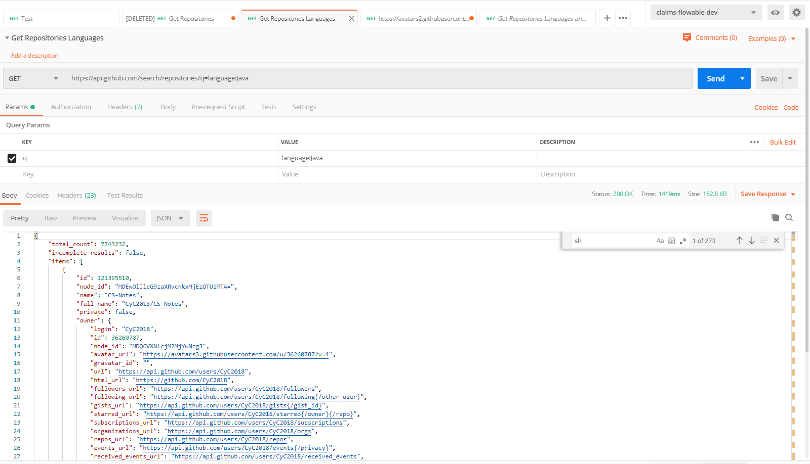

# RetrofitGithub

a Native Java Application to consume Github API to Search for Repositories by Language and Topics 

## Output 


## Github API PostMan


You can get the PostMan https://www.getpostman.com/collections/c5d42af9dbdd56d00337


## Code 

### Manifest

be sure that the internet access is granted to the application 

```xml
 <uses-permission android:name="android.permission.INTERNET" />
```


```xml
<?xml version="1.0" encoding="utf-8"?>
<manifest xmlns:android="http://schemas.android.com/apk/res/android"
    package="com.example.apigithub">
    <uses-permission android:name="android.permission.INTERNET" />

    <application
        android:allowBackup="true"
        android:icon="@mipmap/ic_launcher"
        android:label="@string/app_name"
        android:roundIcon="@mipmap/ic_launcher_round"
        android:supportsRtl="true"
        android:theme="@style/AppTheme">
        <activity android:name=".activity.MainActivity">
            <intent-filter>
                <action android:name="android.intent.action.MAIN" />

                <category android:name="android.intent.category.LAUNCHER" />
            </intent-filter>
        </activity>
    </application>

</manifest> 
```

## Gradel Files 

in `build.gradel` we need these dependincies 

```java
dependencies {
    implementation fileTree(dir: 'libs', include: ['*.jar'])

    implementation 'androidx.appcompat:appcompat:1.1.0'
    implementation 'androidx.constraintlayout:constraintlayout:1.1.3'
    testImplementation 'junit:junit:4.12'
    androidTestImplementation 'androidx.test.ext:junit:1.1.1'
    androidTestImplementation 'androidx.test.espresso:espresso-core:3.2.0'
    implementation 'com.google.code.gson:gson:2.6.2'
    implementation 'com.squareup.retrofit2:retrofit:2.0.2'
    implementation 'com.squareup.retrofit2:converter-gson:2.5.0'
    implementation 'com.android.support:cardview-v7:27.1.1'
    implementation 'com.android.support:appcompat-v7:27.1.1'
    implementation 'com.android.support:design:27.1.1'
}
```
